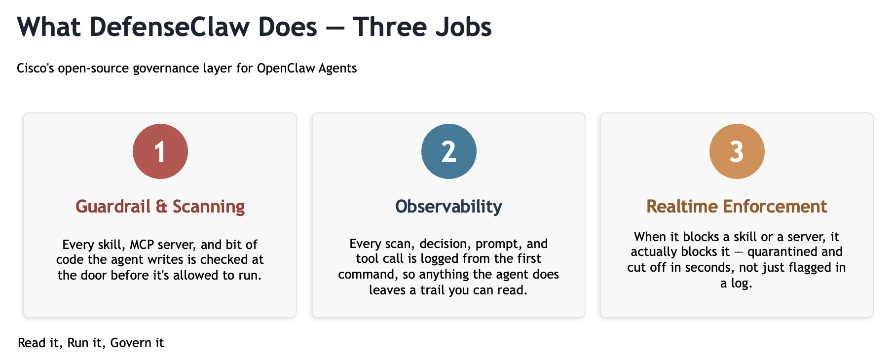
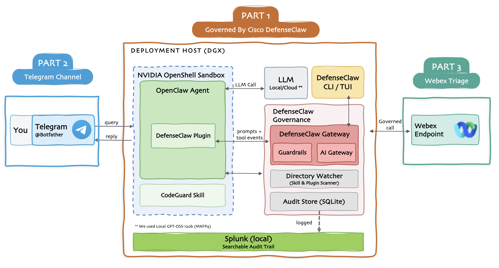

  <h1 class="dc-hero__title">
    OpenClaw:
    Governed by DefenseClaw
  </h1>

# OpenClaw: Governed by DefenseClaw

**Putting OpenClaw + DefenseClaw to work with Telegram Channel and Cisco Webex Endpoint**

Whether you want to build a complete Secured OpenClaw stack or just understand how it works end to end, this post is for you.

I put the whole thing together on my DGX Spark: OpenClaw as the agent, DefenseClaw for governance and enforcement, and Splunk for observability, with Telegram as the channel I talk to it through and a real Webex use case running on top. It's a complete stack you can follow and build yourself. Honestly, I wish I'd had a write-up like this when I started. It would have saved me a lot of time.

I broke the whole project into three parts, and each one stands on its own. Before the build, let's start with the stack itself: what OpenClaw is, and how DefenseClaw and Splunk fit around it.

## What is OpenClaw

OpenClaw is a different kind of AI: it doesn't just answer questions, it acts. It reads your files, runs commands on your machine, and writes its own tools when it needs one. Point it at your inbox and it triages your email; connect it to Webex and it flags the messages that need you, summarizes the ones you missed, and replies on your behalf. Those are the simple examples. The more you connect it to, the longer that list gets, and the limit ends up being your imagination, not the tool. It's the closest thing yet to an operating system for personal AI.

The market has clearly noticed. At GTC 2026, NVIDIA's Jensen Huang called its rise the fastest in open-source history and urged every company to build an OpenClaw strategy of its own. An ecosystem has grown up around it just as fast: some providers offer it managed, hosted, or white-labeled, while others stand up complete on-prem builds, model and all, running entirely on their own hardware and fully dedicated to them.

All that power, and all that momentum, is exactly why governance matters. The real question isn't whether to run an agent like this, it's whether you can see what it's allowed to do, what it's actually doing, and who's watching.

## Enter DefenseClaw

So what does that governance actually look like? The simplest way I can put it: **DefenseClaw is a guard for your agent.**

It wraps around your OpenClaw setup and does what a good guard does. It checks and logs everything that tries to get in, keeps an eye on everything happening inside, and steps in the moment something looks wrong. It's open source, it's from Cisco, and it's running in a few minutes.

And DefenseClaw doesn't work alone. Underneath it, NVIDIA's **OpenShell** keeps the agent in a sandbox, so even if something slips past, it stays contained and can't reach the rest of your machine.

For the deeper "why," [**DJ Sampath**](https://blogs.cisco.com/ai/cisco-announces-defenseclaw){ target="_blank" rel="noopener" } explains it well in his blog, and [**Arjun Sambamoorthy**](https://blogs.cisco.com/ai/defenseclaw-is-live){ target="_blank" rel="noopener" } covers the DefenseClaw stack in his post.

## What I'm Actually Building

In my DGX Spark, I installed OpenClaw governed by DefenseClaw, watched through Splunk, reachable over Telegram, and put to work on Webex. It comes in three parts that build in order, starting with the foundation in Part 1.

1. **[Part 1 (DefenseClaw stack)](part1/index.md):** stand up OpenClaw on the DGX Spark with DefenseClaw governance and Splunk observability.
2. **[Part 2 (Telegram channel)](part2/index.md):** add Telegram so you can reach the agent from your phone, set up so only you can message it.
3. **[Part 3 (Webex use case)](part3/index.md):** wire Webex through its API as governed tools.

This is the first Claw stack. **Nemoclaw** and **Hermes** are next on the list, and will write those up the same way. Follow along if you want to catch them.
