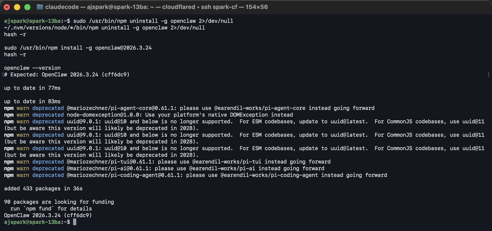
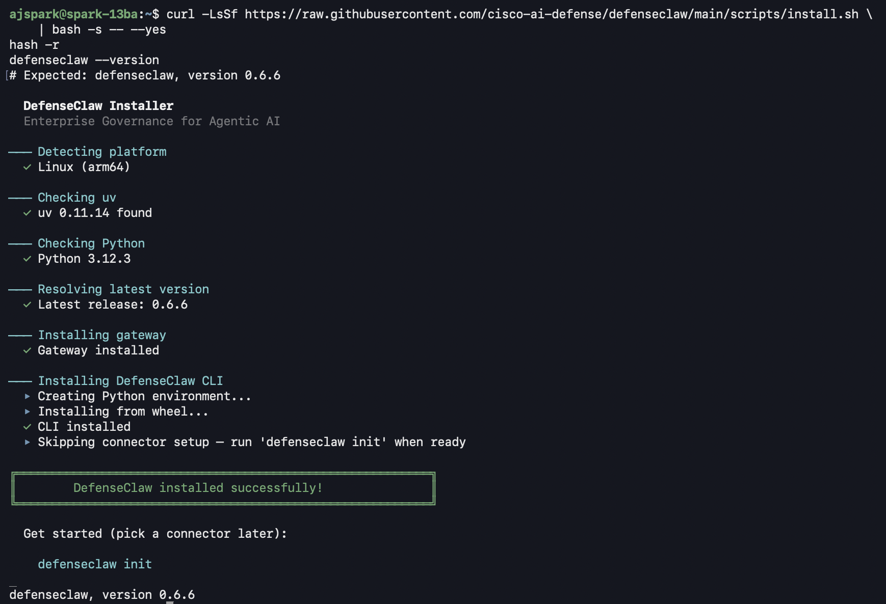

# Step 2 — Install OpenClaw + DefenseClaw

Two installers, in this order. The version pin on OpenClaw matters, it's the version DefenseClaw's installer expects.

## Install OpenClaw (pinned version)

```bash
sudo /usr/bin/npm uninstall -g openclaw 2>/dev/null
~/.nvm/versions/node/*/bin/npm uninstall -g openclaw 2>/dev/null
hash -r

sudo /usr/bin/npm install -g openclaw@2026.3.24
hash -r

openclaw --version
```

??? note "Expected output"
    OpenClaw 2026.3.24 (cff6dc9)



## Install DefenseClaw

```bash
curl -LsSf https://raw.githubusercontent.com/cisco-ai-defense/defenseclaw/main/scripts/install.sh | bash
```

The installer asks which **connector** to wire up. Pick `4` for **openclaw**:

```
─── Pick agent connector
  1) codex
  2) claudecode
  3) zeptoclaw
  4) openclaw     ← pick this one
  5) none
```

!!! warning "If install fails: `No solution found … click==8.3.1 … click==8.1.8`"
    The DefenseClaw 0.7.x wheel declares `click==8.3.1` while its transitive dep `litellm==1.83.7` declares `click==8.1.8` — pins that can never co-resolve. Newer `uv` enforces this strictly. To bypass with a one-shot override:

    ```bash
    cat > /tmp/dc-overrides.txt <<'EOF'
    click
    litellm
    EOF

    UV_OVERRIDE=/tmp/dc-overrides.txt \
      curl -LsSf https://raw.githubusercontent.com/cisco-ai-defense/defenseclaw/main/scripts/install.sh | bash
    ```

    Tracked upstream: [cisco-ai-defense/defenseclaw](https://github.com/cisco-ai-defense/defenseclaw/issues). This block can be removed once Cisco republishes the wheel with looser pins.

Verify:

```bash
defenseclaw --version
```

??? note "Expected output"
    defenseclaw, version 0.7.2



[Continue to Step 3 — Pick your model →](03-setup-model.md){ .md-button .md-button--primary }
