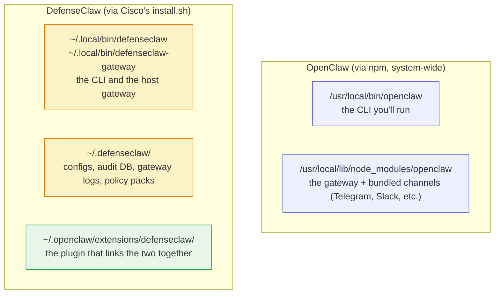

# Step 2 — Install OpenClaw + DefenseClaw

Two installers, in this order. The version pin on OpenClaw matters, it's the version DefenseClaw's installer expects.

## What gets installed where

The two installers drop binaries, config files, and a plugin in a handful of places. Knowing the layout up front makes the rest of this series easier to follow when you need to troubleshoot.



??? info "Why the plugin lives under `~/.openclaw/extensions/`"
    OpenClaw can load third-party plugins from any folder under its extensions directory. DefenseClaw's installer drops itself there as `defenseclaw`, and OpenClaw picks it up automatically the next time the gateway starts. That's the bridge: OpenClaw runs the agent, the DefenseClaw plugin sits inside OpenClaw's process and intercepts every model call.

## Install OpenClaw (pinned version)

```bash
sudo /usr/bin/npm uninstall -g openclaw 2>/dev/null
~/.nvm/versions/node/*/bin/npm uninstall -g openclaw 2>/dev/null
hash -r

sudo /usr/bin/npm install -g openclaw@2026.3.24
hash -r

openclaw --version
```

??? note "Expected output"
    OpenClaw 2026.3.24 (cff6dc9)


## Install DefenseClaw

```bash
cat > /tmp/dc-overrides.txt <<'EOF'
click
litellm
EOF

curl -LsSf https://raw.githubusercontent.com/cisco-ai-defense/defenseclaw/main/scripts/install.sh \
  | UV_OVERRIDE=/tmp/dc-overrides.txt bash
```

The installer asks which **connector** to wire up. Pick `4` for **openclaw**:

```
─── Pick agent connector
  1) codex
  2) claudecode
  3) zeptoclaw
  4) openclaw     ← pick this one
  5) none
```

Verify:

```bash
defenseclaw --version
```

??? note "Expected output"
    defenseclaw, version 0.7.2


[Continue to Step 3 — Pick your model →](03-setup-model.md){ .md-button .md-button--primary }
