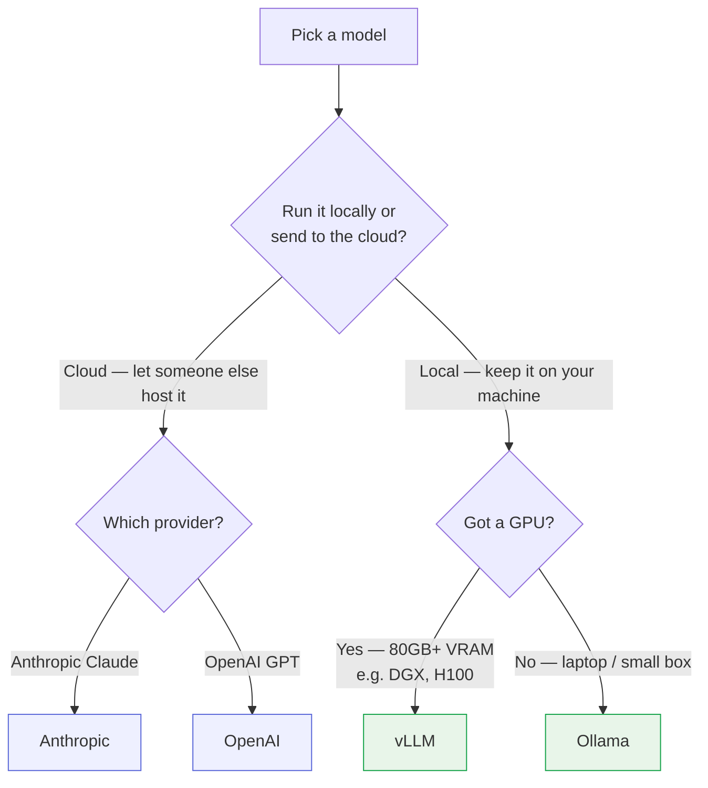

# Step 3 — Pick your model

You've got OpenClaw and DefenseClaw installed. Now the agent needs a brain to think with: an LLM. Pick one here, then continue to **Step 4** to set it up.

## Which one fits your setup?

## Cloud or self-hosted? The trade-offs

| | Cost | Privacy | Hardware |
|---|---|---|---|
| **Cloud** (Anthropic, OpenAI) | Paid per request | Data leaves your machine | None |
| **Self-hosted** (vLLM, Ollama) | Free | Stays on yours | NVIDIA GPU (vLLM) or 4 GB+ RAM (Ollama) |

!!! tip "What we used"
    Self-hosted vLLM with `gpt-oss-120b` on a DGX Spark.

## Choose your model

#### Cloud

<ul class="step-list">
  <li><a href="../step3-anthropic/">A Anthropic</a></li>
  <li><a href="../step3-openai/">O OpenAI</a></li>
</ul>

#### Self-hosted

<ul class="step-list">
  <li><a href="../step3-vllm/">V vLLM (big GPU)</a></li>
  <li><a href="../step3-ollama/">O Ollama (any box)</a></li>
</ul>

