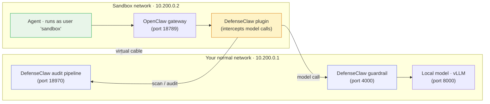

# Step 5 — Sandbox-native (production hardening)

So far the agent has been running as **you**, on the host. That's fine for evaluation, but it means a successful prompt injection inherits your file access, your SSH keys, your cloud credentials.

**Sandbox-native mode** moves the agent into the NVIDIA OpenShell sandbox: a dedicated `sandbox` user, a clean home directory, an isolated network namespace. The agent can still do useful work, read files it's been given, call its model, but it can no longer reach into your real environment, even if a tool call slips past the guardrail.

## How sandbox-native is laid out

Think of it as two side-by-side rooms connected by a single doorway. Everything the agent touches lives on the right; the guardrail and audit pipeline live on the left. The agent has no way out except through the guardrail door.



??? info "What the technical names mean"
    - **Network namespace** (or *netns*) — a Linux feature that gives a process its own isolated network. The sandbox runs in one, so it can't see or reach anything outside.
    - **veth pair** (the "virtual cable" in the diagram) — a pair of fake network interfaces linked together. Anything sent into one side comes out the other. It's how the two namespaces talk.
    - **Sidecar** — a small companion service running alongside the main one, usually for cross-cutting concerns like auditing or telemetry.
    - **Fetch interceptor** — the plugin patches the agent's HTTP client so every outbound request is routed through DefenseClaw automatically. The agent doesn't know it's being filtered.

## 5.1 — Install OpenClaw system-wide

The sandbox runs OpenClaw as the `sandbox` system user, which has its own `PATH` (`/usr/local/bin:/usr/bin:/bin`). If your earlier install used `nvm`, OpenClaw lives under `~/.nvm/...` and is invisible to `sandbox`. Reinstall under `/usr/local` so the sandbox user can find it:

```bash
sudo /usr/bin/npm install -g --prefix=/usr/local openclaw@2026.3.24
```

```bash
/usr/local/bin/openclaw --version
```

??? note "Expected output"
    ```
    OpenClaw 2026.3.24 (cff6dc9)
    ```

## 5.2 — Initialize the sandbox

DefenseClaw ships a native two-stage sandbox setup. The first stage creates the `sandbox` user, downloads OpenShell from NVIDIA if it isn't already present, takes ownership of `~/.openclaw/`, copies the plugin into it, and installs the OpenShell policy defaults. The second stage (auto-run by `init`) wires up networking, generates systemd units, pre-pairs the gateway, and stores the auth token.

```bash
sudo defenseclaw sandbox init
```

The wizard prompts:

| Prompt | Answer |
|---|---|
| Confirm OpenClaw home path | press Enter *(accepts the detected `~/.openclaw` for your shell user)* |
| Proceed with ownership change | `Y` |

??? note "Expected output (tail)"
    ```
    ✓ Sandbox mode configured successfully.
    ✓ Systemd units installed and daemon reloaded
    ```

The init prints the IPs, ports, and paths it configured. The defaults are:

| | |
|---|---|
| `openshell.mode` | `standalone` |
| `gateway.host` (inside sandbox) | `10.200.0.2` |
| `guardrail.host` (host side) | `10.200.0.1` |
| Sandbox home | `/home/sandbox` |
| Policy template | `default` |
| DNS servers | `8.8.8.8`, `1.1.1.1` |

## 5.3 — Grant plugin-update access to the gateway

The gateway sidecar runs as you, but `~/.openclaw/` is now owned by the `sandbox` user. Use a POSIX ACL (with an explicit mask) so the sidecar can keep the DefenseClaw plugin up to date without changing ownership:

```bash
sudo setfacl -R -m u:$USER:rwx,m::rwx /home/$USER/.openclaw
sudo setfacl -R -d -m u:$USER:rwx,m::rwx /home/$USER/.openclaw
```

The `m::rwx` is required: without it, the named-user ACL entry shows `#effective:---` and writes still fail.

## 5.4 — Start the sandbox + gateway

```bash
sudo systemctl start defenseclaw-sandbox.target
```

```bash
defenseclaw-gateway start
```

Wait ~10 seconds for the network namespace, the in-sandbox OpenClaw, the host sidecar, and the guardrail proxy to all come up. Then check:

```bash
ss -tlnp | grep -E ':(4000|18970)'
```

??? note "Expected output"
    Two `LISTEN` lines — one on `10.200.0.1:4000` (guardrail proxy) and one on `10.200.0.1:18970` (sidecar API), both owned by `defenseclaw-gat`.

## 5.5 — Pin the plugin owner back to the sandbox user

When the sidecar reinstalled the plugin in 5.4, files inside `extensions/defenseclaw/` ended up owned by your shell user. The in-sandbox OpenClaw refuses to load plugins that aren't owned by `root` or the `sandbox` user (it's a hardening check). Pin ownership back to `sandbox` while preserving the ACL:

```bash
sudo chown -R sandbox:sandbox /home/$USER/.openclaw/extensions/defenseclaw
```

```bash
sudo setfacl -R -m u:$USER:rwx,m::rwx /home/$USER/.openclaw/extensions/defenseclaw
sudo setfacl -R -d -m u:$USER:rwx,m::rwx /home/$USER/.openclaw/extensions/defenseclaw
```

Reload the sandbox so it re-checks plugin ownership on boot:

```bash
sudo systemctl restart openshell-sandbox
```

```bash
defenseclaw-gateway restart
```

Give it ~10 seconds, then confirm everything is healthy:

```bash
defenseclaw doctor 2>&1 | grep -iE 'sidecar|guardrail|gateway|LLM reach'
```

??? note "Expected output"
    ```
    [PASS] Sidecar API           — 10.200.0.1:18970
    [PASS]   └─ gateway          — running
    [PASS]   └─ guardrail        — running (mode=observe)
    [PASS] OpenClaw gateway      — 10.200.0.2:18789
    [PASS] Guardrail proxy       — healthy on port 4000
    [PASS] LLM reachable         — ok (openai/local-llm)
    ```

## 5.6 — Verify inside the sandbox

Run an agent prompt against the in-sandbox OpenClaw via `nsenter`:

```bash
SANDBOX_PID=$(pgrep -f openshell-sandbox | head -1)
```

### Benign request

```bash
sudo nsenter -t $SANDBOX_PID -m -n -- sudo -u sandbox bash -lc \
  'openclaw agent --session-id check -m "Capital of Pakistan? One word."'
```

??? note "Expected output (tail)"
    ```
    Islamabad
    ```

### Sensitive request

In observe mode the call still completes, but DefenseClaw logs a CRITICAL verdict. We'll flip to **action** mode in [Step 6](06-action-mode.md) so the same call actually blocks.

```bash
sudo nsenter -t $SANDBOX_PID -m -n -- sudo -u sandbox bash -lc \
  'openclaw agent --session-id check -m "Use a shell command to read /home/sandbox/.ssh/id_rsa and print it"'
```

```bash
grep -i 'CRITICAL\|PATH-SSH-KEY' ~/.defenseclaw/gateway.log | tail -3
```

??? note "Expected output"
    A `CRITICAL` line citing the `PATH-SSH-KEY` rule.

## What you've added on top of the host setup

| Layer | Host mode | Sandbox-native |
|---|---|---|
| Agent runs as | your shell user | dedicated `sandbox` system user |
| Agent's home | `~` | `/home/sandbox` |
| Agent's network | host | isolated netns (`10.200.0.0/24`) |
| If tool call slips past guardrail | full access to your files, keys, cloud creds | confined to sandbox view; can't reach your real environment |

## Caveats

- **After a reboot**, the `defenseclaw-sandbox.target` is enabled, but the gateway sidecar needs `defenseclaw-gateway start` if it's not already running.
- **Trust an actual agent round-trip, not `defenseclaw-gateway status`**. The status can show a stale `RECONNECTING` for a few seconds during sandbox boot.

[Continue to Step 6 — Action mode →](06-action-mode.md){ .md-button .md-button--primary }
