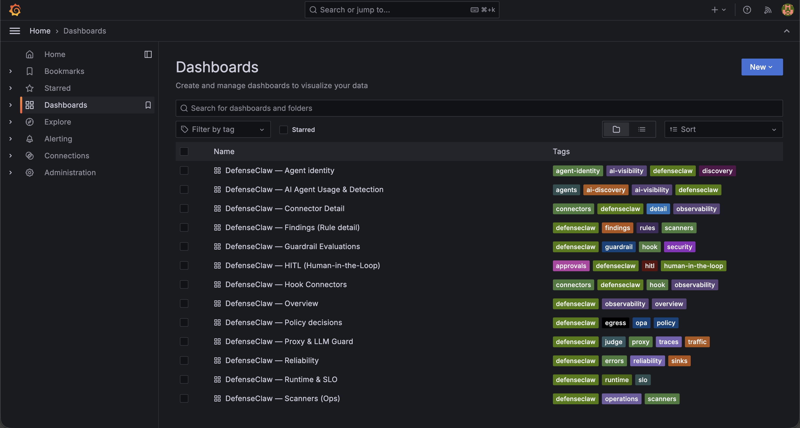

# Step 9 — Other observability tools

Beyond Splunk (Step 7), DefenseClaw exposes a handful of other visualization and health-check surfaces.

## Doctor — full health check

`defenseclaw doctor` walks every subsystem and prints actionable fixes for anything misconfigured.

```bash
defenseclaw doctor
```

## Status dashboard

`defenseclaw status` shows running totals + subsystem state at a glance.

```bash
defenseclaw status
```

## Built-in alerts viewer

A terminal dashboard of every alert event recorded.

```bash
defenseclaw alerts
```

## Bundled local observability stack

DefenseClaw ships a one-command Prometheus + Loki + Tempo + Grafana stack with pre-built dashboards. It listens on these ports:

| Service | Default port |
|---|---|
| Grafana | `3000` |
| Prometheus | `9090` |
| Loki | `3100` |
| Tempo | `3200` |
| OTLP gRPC | `4317` |
| OTLP HTTP | `4318` |

### Remap Grafana if port 3000 is taken

It's common for `3000` to already be in use on a multi-service host (Grafana from another stack, dev servers, brain UIs). Remap Grafana to `3001` by patching the stack files before bringing it up:

```bash
DC=~/.defenseclaw/.venv/lib/python3.12/site-packages/defenseclaw
LOCAL_OBS=$DC/commands/cmd_setup_local_observability.py
SETUP=$DC/commands/cmd_setup.py
COMPOSE=$DC/_data/local_observability_stack/docker-compose.yml
BRIDGE=$DC/_data/local_observability_stack/bin/openclaw-observability-bridge

# Pre-flight port tuple
sed -i 's|(3000, "Grafana")|(3001, "Grafana")|' "$LOCAL_OBS"

# Probe + already-running check
sed -i 's|("127.0.0.1", 3000)|("127.0.0.1", 3001)|g; s|reachable on :3000|reachable on :3001|g' "$SETUP"

# Bridge URLs
sed -i 's|127\.0\.0\.1:3000|127.0.0.1:3001|g; s|localhost:3000|localhost:3001|g' "$BRIDGE"

# Compose host-side port
sed -i 's|}:3000:3000"|}:3001:3000"|g' "$COMPOSE"
```

If your `3000` is free, skip the block above.

### Bring the stack up

```bash
defenseclaw setup local-observability up
```

??? note "Expected output (tail)"
    ```
    Local observability stack is up
    ───────────────────────────────
      Grafana:    http://localhost:3001  (admin / admin)
      Prometheus: http://localhost:9090
      Tempo API:  http://localhost:3200
      Loki API:   http://localhost:3100
      OTLP gRPC:  127.0.0.1:4317
      OTLP HTTP:  127.0.0.1:4318
    ```


### Open Grafana

Grafana is bound to `127.0.0.1:3001` on the host. Reach it from your laptop by SSH-tunnelling:

```bash
ssh -L 3001:127.0.0.1:3001 youruser@your-dgx-host
```

…then browse to **http://localhost:3001** (login: `admin` / `admin`).

If you've already exposed the host through a Cloudflare Access / Tailscale / reverse proxy hostname, hit `https://your-grafana-hostname.example.com` directly instead.

### Pre-provisioned dashboards

DefenseClaw ships **13 dashboards** wired to the same audit pipeline that feeds Splunk in Step 7. They appear under **Dashboards** in the left nav as soon as Grafana boots:



| Dashboard | What it shows |
|---|---|
| Overview | High-level health, scan throughput, top categories |
| AI Agent Usage & Detection | Inbound prompts per agent, sev distribution |
| Guardrail Evaluations | Per-rule hit counts, block vs observe |
| Findings (Rule detail) | Drill-down on a specific rule's matches |
| Connector Detail / Hook Connectors | Per-connector activity |
| HITL (Human-in-the-Loop) | Approval queue, pending verdicts |
| Policy decisions | OPA egress / route decisions |
| Proxy & LLM Guard | Guardrail-proxy traffic, judge calls, traces |
| Reliability | Sink delivery, gateway errors |
| Runtime & SLO | Latency / error budget |
| Scanners (Ops) | Skill + MCP scanner findings |
| Agent identity | Per-agent identity surface |

## Prometheus scrape (existing setup)

If you already run Prometheus, point it at DefenseClaw's metrics endpoint:

```yaml
scrape_configs:
  - job_name: defenseclaw
    static_configs:
      - targets: ['127.0.0.1:18970']
```

Useful queries:

```promql
defenseclaw_scans_total{severity="HIGH"}
rate(defenseclaw_scans_total[5m])
histogram_quantile(0.99, defenseclaw_scan_duration_seconds_bucket)
```

## Audit DB snapshot

The audit DB at `~/.defenseclaw/audit.db` holds every scan event. Snapshot it any time:

```bash
mkdir -p ~/backups/defenseclaw
sqlite3 ~/.defenseclaw/audit.db \
    ".backup '$HOME/backups/defenseclaw/audit-$(date +%Y%m%d).db'"
ls -lh ~/backups/defenseclaw/
```

[Back to Overview →](../index.md){ .md-button }
[Continue to Part 2. Telegram →](../part2/index.md){ .md-button .md-button--primary }
