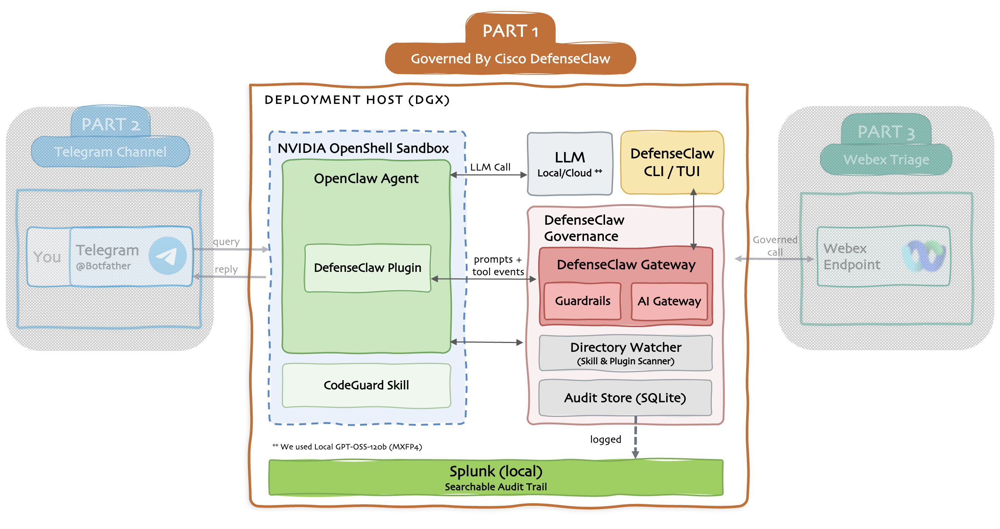

# Part 1 — Governed by Cisco DefenseClaw Stack

The diagram below is the full system we're building: an OpenClaw agent that's governed, sandboxed, and fully observable. Telegram and Webex (Parts 2 and 3) plug into it later. Part 1, the center, is the governed core everything else will be built on top of it.

OpenClaw agents are powerful enough to read files, run commands, and act on your behalf, which is exactly what makes them risky. Part 1 builds that agent the safe way, so the power comes with guardrails, a sandbox, and a full audit trail instead of blind trust.

**The pieces:**

- **OpenClaw**: the agent that does the work, reading files, running commands, and using tools.
- **DefenseClaw**: Cisco's open-source governance layer, and the core of this build. Through a plugin inside the agent it scans everything before it runs, watches every prompt and action in real time, blocks anything dangerous, and records it all. This is what turns a powerful agent into a governed one.
- **NVIDIA OpenShell**: the sandbox the agent runs inside, so anything that slips past still can't reach the rest of the host.
- **The model**: the brain the agent reasons with. It's interchangeable (local or cloud); here it runs locally so nothing has to leave the machine.
- **Splunk**: the searchable audit trail. DefenseClaw logs every scan, decision, and action to it, giving you one place to watch everything the agent does.

Without governance you're trusting the agent, and every skill it installs, to behave. DefenseClaw replaces that trust with checks: nothing runs unchecked, risky actions are stopped in seconds, and every step is logged and can be viewed in Splunk for review.

## Project Steps

### Base install

<ul class="step-list">
  <li><a href="01-prereqs/">1 Prerequisites</a></li>
  <li><a href="02-install/">2 Install OpenClaw + DefenseClaw</a></li>
  <li><a href="03-setup-model/">3 Set up your model</a></li>
</ul>

### Wire it up

<ul class="step-list">
  <li><a href="04a-cloud/">4A Cloud</a></li>
  <li><a href="04b-vllm/">4B vLLM / Ollama</a></li>
  <li><a href="05-sandbox/">5 Sandbox-native</a></li>
  <li><a href="06-action-mode/">6 Action mode (blocking)</a></li>
</ul>

### Observation tools

<ul class="step-list">
  <li><a href="07-splunk/">7 Splunk audit dashboard</a></li>
  <li><a href="08-scanners/">8 Skill + MCP scanners</a></li>
  <li><a href="09-observability/">9 Other observability tools</a></li>
</ul>

[Start with Step 1. Prerequisites →](01-prereqs.md){ .md-button .md-button--primary }
