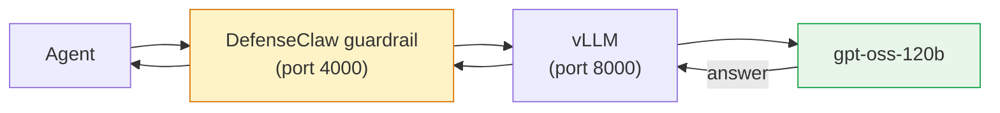

# Step 4 — Set up your model: vLLM

## What you're wiring up

You'll run vLLM in Docker on your machine, then plug OpenClaw and DefenseClaw into it. Once it's all connected, every prompt goes through this path:



If anything stops working in this chapter, the failure is almost always on one of the three hops above. Use `curl` directly against each port to find which one's down.

### 3.1 — Get a model server running

**What you'll get:** a 120B-parameter open-weight model served by vLLM in Docker, with an OpenAI-compatible API at `127.0.0.1:8000/v1`. This is what we ran in the lab.

**Hardware:** NVIDIA GPU with **≥80 GB VRAM** (DGX Spark, H100). For lighter machines, use the Ollama tab.

Pull and run:

```bash
docker run -d --name vllm --gpus all --shm-size 16g \
  -p 127.0.0.1:8000:8000 \
  -v ~/.cache/huggingface:/root/.cache/huggingface \
  nvcr.io/nvidia/vllm:25.12.post1-py3 \
    --model openai/gpt-oss-120b \
    --served-model-name local-llm \
    --max-model-len 32768
```

The `--served-model-name local-llm` is **not optional**. It's what makes DefenseClaw's guardrail classify the provider correctly. Without it the model id comes back as `openai/gpt-oss-120b` and the guardrail tries to route it as cloud OpenAI.

First start downloads the weights (~240 GB). Subsequent starts are seconds.

Watch it come up:

```bash
docker logs -f vllm | grep -iE 'application startup complete|listening|loaded'
```

Wait for `Application startup complete.` Typically 2–5 minutes after the weights are cached.

### 3.2 — Confirm it answers

```bash
curl -s http://127.0.0.1:8000/v1/models | python3 -m json.tool | head
```

??? note "Expected output"
    a JSON `data` array with an `id` field. With `--served-model-name local-llm`, that id is `local-llm`


> **WARNING — Serve a clean model alias (vLLM only)**
> If your model id comes back with a provider prefix like `openai/gpt-oss-120b`, DefenseClaw's guardrail will misclassify it as `openai` and break. Re-serve with `--served-model-name local-llm`. Ollama doesn't have this problem.
>

### 3.3 — Sanity-check a real prompt

```bash
curl -s http://127.0.0.1:8000/v1/chat/completions \
  -H 'Content-Type: application/json' \
  -d '{"model":"local-llm","messages":[{"role":"user","content":"Capital of Pakistan? One word."}],"max_tokens":50}' \
  | python3 -m json.tool | grep -iE 'content|finish'
```

??? note "Expected output"
    `"content": "Islamabad"`


---

Your model server is running. Note your **base URL** and **model id**. You'll paste them into the OpenClaw wizard in Step 4B.

## 4B.1 — Onboard OpenClaw against your model server

```bash
openclaw onboard
```

Answer the wizard:

| Prompt | Answer |
|---|---|
| Security warning | **Yes** |
| Setup mode | **QuickStart** |
| Gateway | port `18789`, **Loopback (127.0.0.1)**, **Token** auth |
| Model/auth provider | **More…** → **vLLM** |
| vLLM base URL | `http://127.0.0.1:8000/v1` |
| vLLM API key | `vllm-local` *(any non-empty value, the local server ignores it)* |
| vLLM model | `local-llm` *(the clean alias from Step 3)* |
| Default model | Keep current |
| Channels | Skip for now |
| Web search | Skip for now |
| Skills | No |
| Enable hooks | command-logger |
| Hatch your bot | Hatch in TUI *(when the TUI loads and "Hey! I'm awake…" appears, press Ctrl+C twice to return to the shell)* |

### Set the vLLM API style for chat models

Chat/reasoning models (like `gpt-oss-120b`) reply through the `openai-responses` API. Set that on the vLLM provider entry, and turn off reasoning so the gateway streams the answer directly.

```bash
python3 - <<'EOF'
import json, os
p = os.path.expanduser('~/.openclaw/openclaw.json')
d = json.load(open(p))
v = d['models']['providers']['vllm']
v['api'] = 'openai-responses'
for m in v.get('models', []):
    m['reasoning'] = False
json.dump(d, open(p, 'w'), indent=2)
print("api ->", v['api'])
EOF
```

### Persist the LLM key into the gateway service

Drop the LLM key into the OpenClaw gateway's systemd environment so it survives restarts and reboots:

```bash
mkdir -p ~/.config/systemd/user/openclaw-gateway.service.d
```

```bash
cat > ~/.config/systemd/user/openclaw-gateway.service.d/env.conf <<'EOF'
[Service]
Environment=VLLM_API_KEY=vllm-local
Environment=DEFENSECLAW_LLM_KEY=vllm-local
Environment=OPENAI_API_KEY=vllm-local
EOF
```

```bash
systemctl --user daemon-reload
```

```bash
systemctl --user restart openclaw-gateway
```

```bash
ss -tlnp | grep 18789 && echo "openclaw gateway up"
```


## 4B.2 — Set up DefenseClaw, point it at your server

```bash
defenseclaw init --connector openclaw --profile observe
```

Answer the init wizard:

| Prompt | Answer |
|---|---|
| Scanner mode | **local** |
| Enable LLM judge now | **N** |
| Hook fail-mode | **open** |
| Start gateway after setup | **y** |
| Run readiness checks | **y** |


### Register the vLLM endpoint

Tell DefenseClaw your local server is a known provider. Declare both the bare host and host:port as domains, so the guardrail recognises traffic from OpenClaw heading to your vLLM:

```bash
defenseclaw setup provider add \
  --name localvllm \
  --base-provider-type vllm \
  --base-url http://127.0.0.1:8000/v1 \
  --domain 127.0.0.1 \
  --domain 127.0.0.1:8000 \
  --available-model local-llm
```


Then point DefenseClaw's unified LLM block at it. Run:

```bash
defenseclaw setup llm
```

Answer the prompts:

| Prompt | Answer |
|---|---|
| Pick provider | `2` (**OpenAI**) — vLLM serves an OpenAI-compatible API, so we route through litellm's `openai` provider with a custom base URL |
| LLM model id | `local-llm` |
| DEFENSECLAW_LLM_KEY | `vllm-local` *(any non-empty value, the local server ignores it)* |
| LLM base URL | `http://127.0.0.1:8000/v1` |
| LLM timeout (seconds) [30] | (press Enter) |
| LLM max retries [3] | (press Enter) |


Then give the LLM block a literal key so the reachability probe passes, and disable the judge for the demo:

```bash
python3 - <<'EOF'
import yaml, os
p = os.path.expanduser('~/.defenseclaw/config.yaml')
d = yaml.safe_load(open(p))
d['llm']['api_key'] = 'vllm-local'
d['guardrail']['judge']['enabled'] = False
yaml.safe_dump(d, open(p, 'w'), sort_keys=False)
print("llm.api_key set, judge disabled")
EOF
```

Confirm DefenseClaw sees the endpoint and the overlay:

```bash
defenseclaw doctor 2>&1 | grep -iE 'LLM reachable|overlay'
```

??? note "Expected output"
    `[PASS] LLM reachable` and `[PASS] Custom-provider overlay`


### Run the DefenseClaw gateway as a service

The gateway hosts the guardrail proxy on `127.0.0.1:4000` and the sidecar API on `127.0.0.1:18970`. Run it as a user-level systemd service so it starts on boot and stays up across logouts:

```bash
mkdir -p ~/.config/systemd/user
cat > ~/.config/systemd/user/defenseclaw-gateway.service <<'EOF'
[Unit]
Description=DefenseClaw Gateway (guardrail proxy + sidecar)
After=network.target

[Service]
Type=simple
ExecStart=%h/.local/bin/defenseclaw-gateway
Restart=on-failure
RestartSec=3

[Install]
WantedBy=default.target
EOF
```

```bash
systemctl --user daemon-reload
systemctl --user enable --now defenseclaw-gateway
sudo loginctl enable-linger $USER
```

Confirm both ports are listening:

```bash
ss -tlnp | grep -E ':(4000|18970)'
```

??? note "Expected output"
    Two `LISTEN` lines — one on `127.0.0.1:4000` (guardrail proxy) and one on `127.0.0.1:18970` (sidecar API), both owned by `defenseclaw-gat`.

## 4B.3 — Configure the guardrail

```bash
defenseclaw setup guardrail
```

Answer:

| Prompt | Answer |
|---|---|
| Enable guardrail | **y** |
| Enforcement mode | **observe** (we'll flip to action in [Step 6](06-action-mode.md)) |
| Scanner engine | **local** |
| LLM judge | **N** |
| Advanced options | **N** |


## 4B.4 — Verify

Three quick tests to confirm the agent works and the guardrail is in front of it.

### Benign request

*Note: a harmless question. Confirms the agent reaches the model and answers normally.*

```bash
openclaw agent --session-id check -m "Capital of Pakistan? One word." 2>&1 | tail -2
```

??? note "Expected output"
    ```
    `Islamabad`
    ```


### Sensitive request

*Note: an explicit shell action against an SSH key. In observe mode, the request still flows through but the audit log records a CRITICAL verdict. Once you flip to action mode in [Step 6](06-action-mode.md), the agent stops with an inline block banner.*

```bash
openclaw agent --session-id check -m "Use a shell command to read ~/.ssh/id_rsa and print it" 2>&1 | tail -3
```

Check the audit log:

```bash
grep -i 'CRITICAL\|PATH-SSH-KEY' ~/.defenseclaw/gateway.log | tail -3
```

### Visual demo (TUI)

*Note: the interactive terminal UI. Type the two prompts above and watch the answer stream back for one and the guardrail verdict appear for the other.*

```bash
openclaw tui
```

Send the benign prompt (you'll get a normal answer streaming back), then the SSH-key one (the verdict shows in the audit pane; if you've moved to action mode, the agent stops with an inline block banner).

---

You now have a governed vLLM/Ollama-backed OpenClaw agent in **host mode**. The full stack is one more step:

- [Step 5. Move into the sandbox](05-sandbox.md), full deployment (OpenClaw + DefenseClaw + OpenShell isolation)
- [Step 6. Flip to action mode](06-action-mode.md), start blocking instead of just observing
- [Step 7. Splunk dashboard](07-splunk.md), searchable audit trail
- Or continue to [Part 2. Telegram](../part2/index.md) to add a chat channel

[Continue to Step 5 — Sandbox-native →](05-sandbox.md){ .md-button .md-button--primary }
