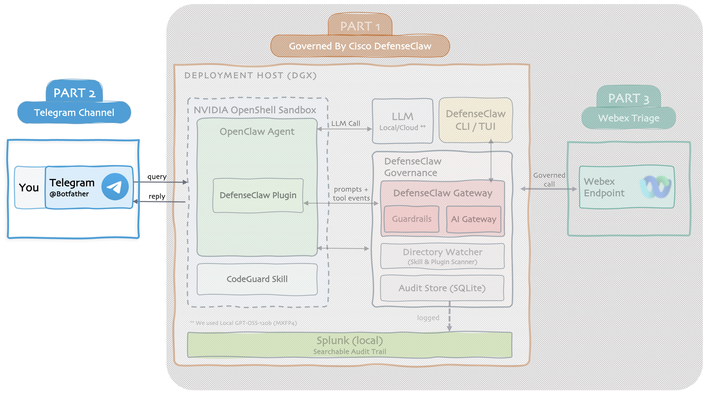

# Part 2 — Telegram Channel

Reach your governed agent from Telegram, a native channel, locked down, with the DefenseClaw guardrail in front.

## What you'll build

- A **Telegram bot** you can chat with from your phone, same governed agent behind it
- **Locked down**, only people you allow can reach it
- Every Telegram message scanned by DefenseClaw, just like a TUI prompt

## Before you start

Make sure you've completed [Part 1](../part1/index.md).

## Project Steps

### Setup

<ul class="step-list">
  <li><a href="phase-1/">1 Create a Telegram bot</a></li>
  <li><a href="phase-2/">2 Add as OpenClaw channel</a></li>
  <li><a href="phase-3/">3 Lock it down</a></li>
</ul>

### Verify + wrap-up

<ul class="step-list">
  <li><a href="phase-4/">4 Verify chat + governance</a></li>
  <li><a href="phase-5/">5 Catch an injection</a></li>
</ul>

[Start Step 1. Create the Telegram bot →](phase-1.md){ .md-button .md-button--primary }
