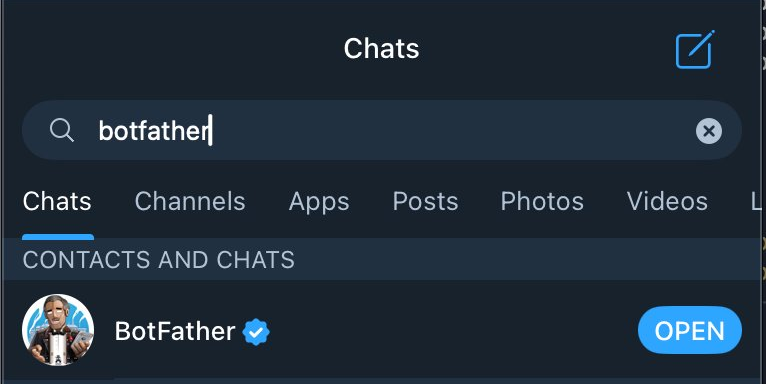
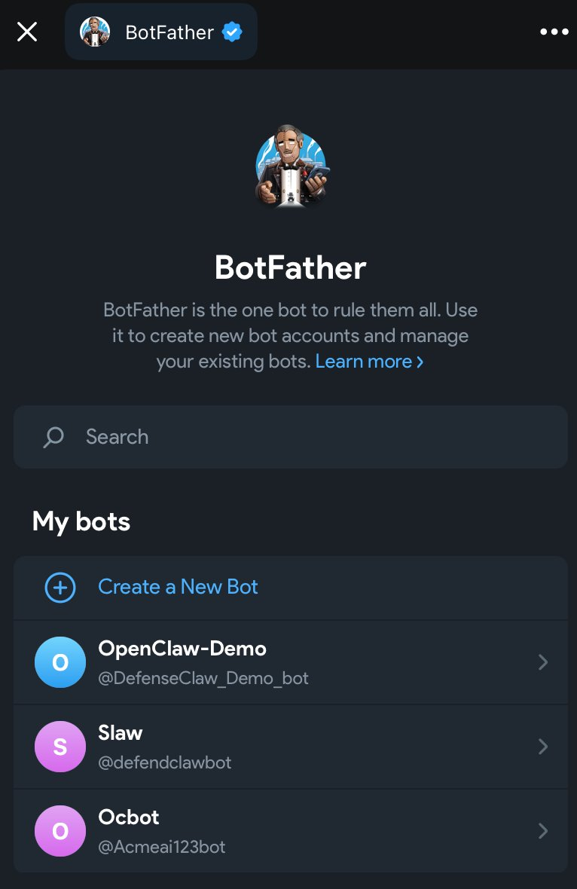
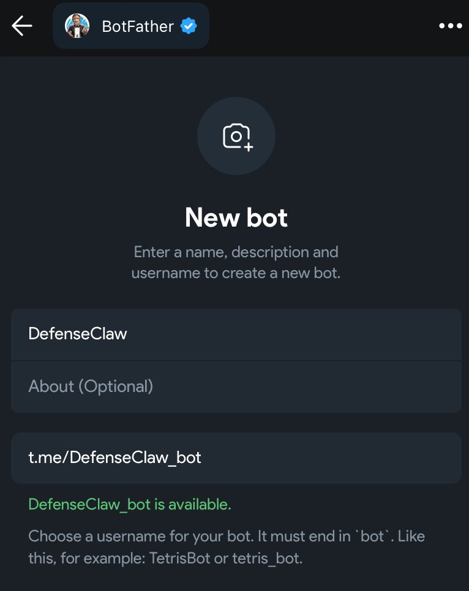
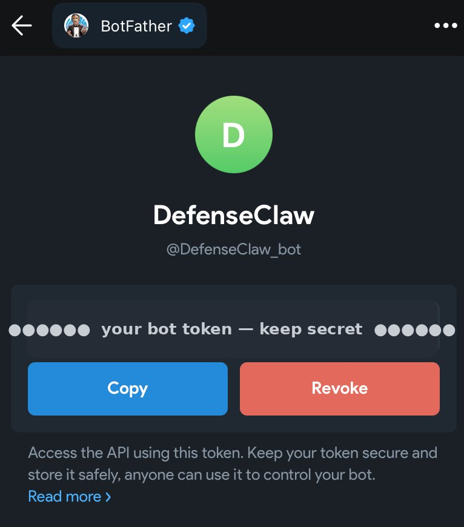
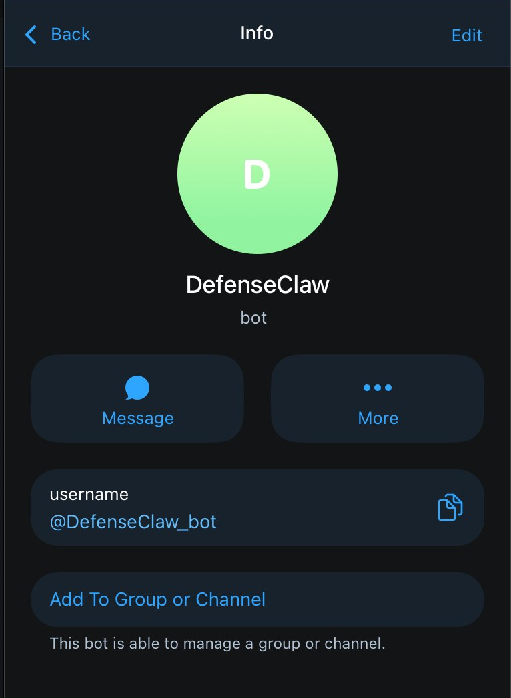

# Step 1 — Create the Telegram bot (BotFather)

A Telegram bot is an account you control through an HTTP API token. You create it inside the Telegram app by chatting with @BotFather, the official bot-for-making-bots. OpenClaw uses the token to send and receive messages.

<div class="step-with-shot" markdown>

{ .phone-shot }

## 1. Find BotFather

In any Telegram client, search `botfather` and open the verified one (blue check). Ignore the look-alikes that show up in global search.

</div>

<div class="step-with-shot" markdown>

{ .phone-shot }

## 2. Create a new bot

Send `/newbot`, or open the BotFather menu and tap **Create a New Bot**:

```
/newbot
```

</div>

<div class="step-with-shot" markdown>

{ .phone-shot }

## 3. Name the bot

Give it a display name, then a username that ends in `bot`. BotFather confirms when the username is free.

</div>

<div class="step-with-shot" markdown>

{ .phone-shot }

## 4. Copy the token

BotFather replies with an HTTP API token (like `123456789:AAExample…`). This is what OpenClaw uses; you'll paste it in Step 2.

!!! warning "The token is a secret, treat it like a password"
    Anyone holding the token can drive your bot. Don't paste it into chats, commits, or screenshots. If it ever leaks, run `/revoke` in @BotFather to invalidate it and issue a new one. Store it the way you'd store an API key.

</div>

<div class="step-with-shot" markdown>

{ .phone-shot }

Your bot now exists as its own account, reachable by anyone until you lock it down in Step 3.

</div>

## 5. Turn on privacy mode

So the bot only sees messages that mention it or are commands:

```
/mybots  →  (pick your bot)  →  Bot Settings  →  Group Privacy  →  Turn ON
```

## 6. Collect numeric Telegram user IDs

You'll allowlist these in Step 3, yours and each teammate's:

```
# in Telegram, message @userinfobot (or @RawDataBot)
# it replies with your numeric id, e.g. Id: 8675309
```

[Continue to Step 2. Add Telegram as an OpenClaw channel →](phase-2.md){ .md-button .md-button--primary }
