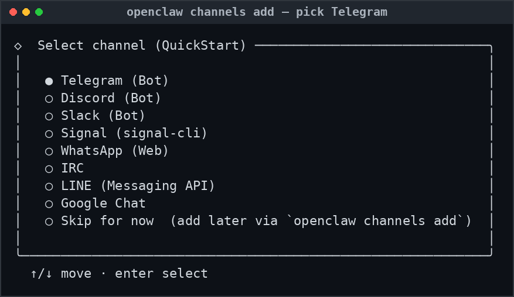
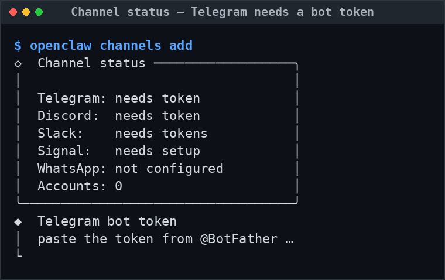

# Step 2 — Add Telegram as an OpenClaw channel

Telegram is bundled with OpenClaw, so there's no code to write, you add it through OpenClaw's interactive channel flow and paste the token. (Contrast with Webex in Part 3, which is *not* bundled and needs OAuth + REST tool wiring.)

Run this on the OpenClaw instance you're keeping as the assistant. If it runs in a container, exec into it first (`docker exec -it <your-openclaw> bash`) and make sure the daemon is running.

<div class="step-with-shot" markdown>

{ .terminal-shot }

## 1. Open the channel picker

```bash
openclaw channels add
```

</div>

<div class="step-with-shot" markdown>

{ .terminal-shot }

## 2. Choose Telegram (Bot) and paste the token

Pick **Telegram (Bot)** and paste the BotFather token when prompted. Until you do, the channel reads "needs token."

</div>

## 3. Confirm it's live

OpenClaw writes the channel into `~/.openclaw/openclaw.json` and starts listening.

```bash
openclaw channels list
# expect Telegram listed as configured / connected
```

!!! tip "Same agent, new doorway"
    You are not changing the model wiring or governance from Part 1, your LLM and the DefenseClaw guardrail carry over untouched. Telegram is purely an additional input surface onto the same agent. That's exactly why Step 3 matters.

[Continue to Step 3. Lock it down →](phase-3.md){ .md-button .md-button--primary }
