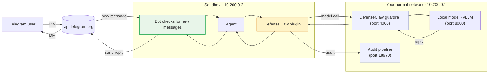

# Step 2 — Add Telegram as an OpenClaw channel

Telegram ships with OpenClaw as a bundled channel — no code to write, just configuration. Six steps:

1. Install the Telegram-capable OpenClaw release
2. Hand the gateway off to the sandbox
3. Point the in-sandbox plugin at the sandbox-side guardrail proxy
4. Pass the gateway token into the sandbox so the plugin can authenticate
5. Register the bot and approve the pairing
6. Verify end-to-end with a real DM

About five minutes total once you have a bot token from [Step 1](phase-1.md).

## Where Telegram fits in the picture

The bot lives **inside the sandbox** — it checks for new messages from Telegram, the agent answers, and the answer travels back to Telegram. Every model call still goes through the same DefenseClaw guardrail you set up in Part 1.



??? info "What the bot is actually doing"
    Telegram bots don't get pushed to — they poll. The bot calls `api.telegram.org/.../getUpdates` every second or so to ask "any new messages for me?" and Telegram replies with whatever's queued. Replies go back the other way as `sendMessage` calls. The whole exchange happens over plain HTTPS, no websockets or persistent connection required.

## 2.1 — Install OpenClaw

This series is written against **OpenClaw `2026.2.17`** — the release whose Telegram channel-loader matches the sandbox wiring we set up in Part 1. Install it system-wide so the `sandbox` user can find it on its `PATH`:

```bash
sudo /usr/bin/npm install -g --prefix=/usr/local openclaw@2026.2.17
```

```bash
/usr/local/bin/openclaw --version
```

??? note "Expected output"
    ```
    2026.2.17
    ```

OpenClaw checks the schema of `~/.openclaw/openclaw.json` against the release it's running. If anything looks unfamiliar (you'll see a banner like `Unrecognized key: "commands.ownerDisplay"`), let `doctor` align it:

```bash
openclaw doctor --fix
```

## 2.2 — Hand the gateway off to the sandbox

When you ran `openclaw onboard` back in Part 1 Step 4, it set up a copy of the OpenClaw gateway running directly on your machine. Step 5's sandbox-init then started a second copy *inside* the sandbox. They both want to use port `18789` — they're meant to be one or the other, not both. Now that you've moved to sandbox mode, switch off the one on your host:

```bash
systemctl --user stop openclaw-gateway
systemctl --user disable openclaw-gateway
```

??? note "Expected output"
    ```
    Removed "~/.config/systemd/user/default.target.wants/openclaw-gateway.service".
    ```

From here on, the in-sandbox gateway is the only one running.

## 2.3 — Tell the plugin where the guardrail lives

The DefenseClaw plugin routes every model call through the guardrail. By default it assumes the guardrail is on the same machine as itself (`127.0.0.1:4000`) — true in host mode. In sandbox mode, the plugin is *inside* the sandbox and the guardrail is *outside*, reachable at **`10.200.0.1:4000`** (the default that `defenseclaw sandbox init` set up). Three small edits point the plugin at the right address:

```bash
PLUGIN_DIR=~/.openclaw/extensions/defenseclaw
```

```bash
sudo sed -i 's|`http://127.0.0.1:${guardrailPort}`|`http://10.200.0.1:${guardrailPort}`|' \
  "$PLUGIN_DIR/dist/fetch-interceptor.js"
sudo sed -i 's|hostname: "127.0.0.1"|hostname: "10.200.0.1"|' \
  "$PLUGIN_DIR/dist/fetch-interceptor.js"
sudo sed -i 's|const DEFAULT_HOST = "127.0.0.1"|const DEFAULT_HOST = "10.200.0.1"|' \
  "$PLUGIN_DIR/dist/sidecar-config.js"
```

The plugin's files must be owned by the `sandbox` user (Part 1 Step 5 explains why). Reapply that ownership and keep an extended permission for yourself so the host-side service can still update the plugin when needed:

```bash
sudo chown -R sandbox:sandbox "$PLUGIN_DIR"
sudo setfacl -R -m u:$USER:rwx,m::rwx "$PLUGIN_DIR"
sudo setfacl -R -d -m u:$USER:rwx,m::rwx "$PLUGIN_DIR"
```

!!! tip "If you used custom network addresses"
    The defaults from `defenseclaw sandbox init` are `10.200.0.1` for the host side and `10.200.0.2` for the sandbox side. If you picked different ones during init, swap those numbers in the `sed` commands above. Otherwise, leave them as-is.

## 2.4 — Share the gateway's password with the sandbox

DefenseClaw's audit pipeline (running on port `18970`) requires a password before it'll accept connections. The plugin inside the sandbox reads that password from an environment variable called `OPENCLAW_GATEWAY_TOKEN`. Your password already lives in `~/.defenseclaw/.env` — read it from there and pass it into the sandbox at startup:

```bash
TOKEN=$(grep '^OPENCLAW_GATEWAY_TOKEN=' ~/.defenseclaw/.env | cut -d= -f2-)
```

```bash
sudo grep -q OPENCLAW_GATEWAY_TOKEN /home/sandbox/start-openclaw.sh || \
  sudo sed -i "/^set -euo pipefail/a export OPENCLAW_GATEWAY_TOKEN=\"$TOKEN\"" \
    /home/sandbox/start-openclaw.sh
```

Confirm:

```bash
sudo grep OPENCLAW_GATEWAY_TOKEN /home/sandbox/start-openclaw.sh
```

??? note "Expected output"
    ```
    export OPENCLAW_GATEWAY_TOKEN="…your-token…"
    ```

Restart the sandbox so it picks up the new address and password:

```bash
sudo systemctl restart openshell-sandbox
```

Wait about 15 seconds — the sandbox needs to spin up its isolated network, get DNS working, and start the gateway.

## 2.5 — Register the bot

This command reaches into the sandbox, hands the bot token to the gateway, and saves it to the gateway's config:

```bash
SANDBOX_PID=$(pgrep -f openshell-sandbox | head -1)
```

```bash
sudo nsenter -t $SANDBOX_PID -m -n -- sudo -u sandbox bash -lc \
  "OPENCLAW_GATEWAY_TOKEN='$TOKEN' openclaw channels add \
     --channel telegram \
     --token '<paste-your-bot-token>' \
     --name 'My Bot'"
```

??? note "Expected output (tail)"
    ```
    Added telegram account "default".
    ```

Restart the sandbox once more so it picks up the new channel and starts checking Telegram for messages:

```bash
sudo systemctl restart openshell-sandbox
sleep 15
```

Confirm the channel is live:

```bash
SANDBOX_PID=$(pgrep -f openshell-sandbox | head -1)
sudo nsenter -t $SANDBOX_PID -m -n -- sudo -u sandbox bash -lc \
  "OPENCLAW_GATEWAY_TOKEN='$TOKEN' openclaw channels list"
```

??? note "Expected output (tail)"
    ```
    Chat channels:
    - Telegram default (My Bot): configured, token=config, enabled
    ```

## 2.6 — Approve the pairing

Open Telegram on your phone, find your bot (the username you chose in [Step 1](phase-1.md)), and send any message — *"hi"* works. The bot replies with a pairing code:

```
OpenClaw: access not configured.

Your Telegram user id: <your-id>
Pairing code: <8-char-code>

Ask the bot owner to approve with:
openclaw pairing approve telegram <8-char-code>
```

Run that approval against the in-sandbox gateway:

```bash
sudo nsenter -t $SANDBOX_PID -m -n -- sudo -u sandbox bash -lc \
  "OPENCLAW_GATEWAY_TOKEN='$TOKEN' openclaw pairing approve telegram <8-char-code>"
```

??? note "Expected output"
    ```
    Approved telegram sender <your-id>.
    ```

## 2.7 — Send a real DM

From Telegram, DM the bot:

> *Capital of Pakistan? One word.*

??? note "Expected reply"
    ```
    Islamabad.
    ```

What just happened, end to end: your DM hit Telegram, the bot inside the sandbox picked it up, the DefenseClaw plugin sent it through the guardrail on the host side, the guardrail forwarded it to your local model, the model answered, and the answer travelled back to your phone. Every message and every reply is now scanned by the same guardrail that scanned everything you typed into the terminal in Part 1.

[Continue to Step 3. Lock it down →](phase-3.md){ .md-button .md-button--primary }
