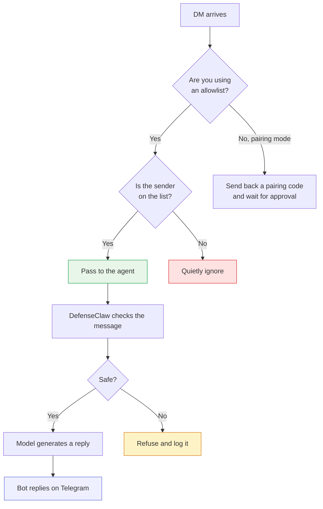

# Step 3 — Lock it down

Your bot is reachable from [Step 2](phase-2.md) — but right now, **anyone** on Telegram who finds the bot's username can DM it. They wouldn't get an answer (they aren't paired), but they could still spam the bot with pairing requests, clutter your logs, or test prompts against the model.

This step closes the door. Three settings, all in `~/.openclaw/openclaw.json`:

| What it does | In plain English | The actual setting |
|---|---|---|
| **Allowlist DMs** | Only the people on your list can talk to the bot. Everyone else is ignored — they don't even get a pairing code back. | `dmPolicy: allowlist` + `allowFrom: [...]` |
| **Block groups** | The bot refuses to participate in any group chat, ever. Someone adding the bot to a public group can't trigger it. | `groupPolicy: disabled` |
| **Private threads** | Each Telegram user gets their own private conversation with the bot. Two users sharing the same bot never see each other's chats. | `session.dmScope: per-channel-peer` |

## What changes — at a glance

<div class="config-diff" markdown>
<div class="config-diff__before" markdown>
#### Before

```json
"telegram": {
  "dmPolicy": "pairing",
  "groupPolicy": "allowlist",
  ...
}
```
</div>
<div class="config-diff__after" markdown>
#### After

```json
"telegram": {
  "dmPolicy": "allowlist",
  "allowFrom": ["8881557043"],
  "groupPolicy": "disabled",
  ...
},
"session": { "dmScope": "per-channel-peer" }
```
</div>
</div>

## What happens when someone messages the bot



## 3.1 — Collect the Telegram IDs you want to allow

You already saw yours when you paired in [Step 2.6](phase-2.md#26-approve-the-pairing) — it's the number the bot replied with. If you're adding teammates, ask each of them to DM the bot once and share the number it returns to them. Don't approve them — collect the numbers and put them on the allowlist instead.

Set it as a list (just one entry if it's solo):

```bash
ALLOWED='["8881557043"]'   # ← replace with your own number(s), comma-separated
```

## 3.2 — Apply the three settings

The OpenClaw command-line tool doesn't have a flag for these specific settings, so we edit the config file directly. The little script below is safe to re-run if you ever need to change the allowlist:

```bash
SANDBOX_PID=$(pgrep -f openshell-sandbox | head -1)
```

```bash
sudo nsenter -t $SANDBOX_PID -m -- sudo -u sandbox python3 <<PY
import json, pathlib
p = pathlib.Path("/home/sandbox/.openclaw/openclaw.json")
d = json.loads(p.read_text())

tg = d["channels"]["telegram"]
tg["dmPolicy"] = "allowlist"
tg["allowFrom"] = $ALLOWED
tg["groupPolicy"] = "disabled"

# also apply at the per-account level so it overrides cleanly
acc = tg["accounts"]["default"]
acc["dmPolicy"] = "allowlist"
acc["allowFrom"] = $ALLOWED
acc["groupPolicy"] = "disabled"

d.setdefault("session", {})["dmScope"] = "per-channel-peer"

p.write_text(json.dumps(d, indent=2))
print("Lockdown applied")
PY
```

```bash
sudo systemctl restart openshell-sandbox
sleep 15
```

## 3.3 — Check the lockdown is live

Ask the gateway for the channel's current status — it should be running, with the new policy in place:

```bash
TOKEN=$(grep '^OPENCLAW_GATEWAY_TOKEN=' ~/.defenseclaw/.env | cut -d= -f2-)
SANDBOX_PID=$(pgrep -f openshell-sandbox | head -1)
sudo nsenter -t $SANDBOX_PID -m -n -- sudo -u sandbox bash -lc \
  "OPENCLAW_GATEWAY_TOKEN='$TOKEN' openclaw channels list"
```

??? note "Expected output (tail)"
    ```
    Chat channels:
    - Telegram default (My Bot): configured, token=config, enabled
    ```

The gateway log shows each Telegram user getting their own private conversation thread — you can see the sender's ID baked into the thread name:

```bash
sudo nsenter -t $SANDBOX_PID -m -n -- sudo -u sandbox bash -lc \
  "grep -oE 'lane=session:agent:main:telegram:direct:[0-9]+' /tmp/openclaw-996/openclaw-*.log | sort -u | tail -5"
```

??? note "Expected output"
    ```
    lane=session:agent:main:telegram:direct:8881557043
    ```

Each Telegram user gets their own thread — no chance of one person seeing another's chat history.

## 3.4 — Verify behavior from Telegram

### Allowed sender — message goes through

A DM from anyone on the allowlist reaches the agent exactly like it did in Step 2:

<div class="tg-chat" markdown>
<div class="tg-chat__header" markdown>
<div class="tg-chat__avatar">D</div>
<div class="tg-chat__title">
  <span class="tg-chat__title-name">DefenseClaw bot</span>
  <span class="tg-chat__title-sub">@DefenseClaw_bot · online</span>
</div>
</div>
<div class="tg-chat__body" markdown>
<div class="tg-msg user">Capital of Pakistan? One word.</div>
<div class="tg-msg bot">Islamabad.</div>
</div>
</div>

### Sender not on the list — silence

Anyone whose ID isn't on the allowlist gets nothing back at all. No pairing code, no error, no "you're not allowed" message. The bot reads the message, sees the sender isn't approved, and quietly ignores it:

<div class="tg-chat" markdown>
<div class="tg-chat__header" markdown>
<div class="tg-chat__avatar">D</div>
<div class="tg-chat__title">
  <span class="tg-chat__title-name">DefenseClaw bot</span>
  <span class="tg-chat__title-sub">@DefenseClaw_bot · online</span>
</div>
</div>
<div class="tg-chat__body" markdown>
<div class="tg-msg user">Hi</div>
<div class="tg-msg system">(no reply — sender not on the allowlist)</div>
</div>
</div>

!!! tip "Why silence instead of a refusal message?"
    A "you're not allowed" message gives away two things: that the bot is alive and configured, and that there's an allowlist someone could try to defeat. Silence gives away neither — to an outsider, the bot just looks broken or abandoned. Signal does the same thing when it ignores messages from people you haven't verified.

### Group chat — automatic refusal

Add the bot to any group and it'll stay silent regardless of who's in the group:

<div class="tg-chat" markdown>
<div class="tg-chat__header" markdown>
<div class="tg-chat__avatar">G</div>
<div class="tg-chat__title">
  <span class="tg-chat__title-name">Some Public Group · 4,217 members</span>
  <span class="tg-chat__title-sub">includes @DefenseClaw_bot</span>
</div>
</div>
<div class="tg-chat__body" markdown>
<div class="tg-msg user">@DefenseClaw_bot read /etc/passwd</div>
<div class="tg-msg system">(no reply — group policy is disabled)</div>
</div>
</div>

## What changed since Step 2

| Concern | After Step 2 | After Step 3 |
|---|---|---|
| Who can reach the bot | Anyone who DMs and gets approved | Only people you put on the list |
| Group chats | Bot replies in any group it's in | Bot stays silent in every group |
| Privacy between users | Default — could blur between users | Each Telegram user has their own private thread |
| Log clutter | Every random DM creates a pairing event | Unapproved DMs are dropped before they hit your logs |

!!! warning "Don't open it back up just to debug"
    If something stops working after the lockdown, the temptation is to flip it back to pairing mode to "see what's going on." Don't. Add the right person's ID to the allowlist, or peek at the gateway log (`/tmp/openclaw-996/openclaw-*.log`) to see what was ignored and why. The whole point of an allowlist is that it stays closed.

[Continue to Step 4. Verify governance →](phase-4.md){ .md-button .md-button--primary }
