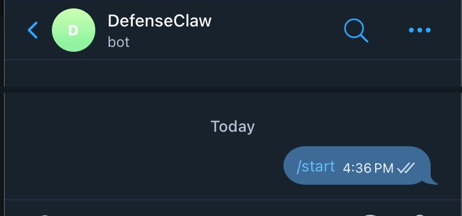

# Step 4 — Verify: chat + watch governance

Confirm the round-trip, a Telegram message reaches the agent, the local model answers, and the message shows up governed in the same places you used in Part 1.

<div class="step-with-shot" markdown>

{ .phone-shot }

## 1. Send a test message

From an allowlisted account, message your bot (mention it if gating is on):

```
@YourBotName what is the capital of France?
```

??? note "Expected output"
    A reply from your governed agent: `Paris`

</div>

## 2. Watch it land governed

Same surfaces as Part 1:

```bash
defenseclaw tui
# Activity shows the Telegram-sourced prompt scanned
```

Or in Splunk:

```spl
index=defenseclaw_local sourcetype="defenseclaw:json"
| table _time sev cats reason
```

!!! tip "Definition of done for Part 2"
    - An allowlisted teammate gets a real answer from the bot in Telegram.
    - A non-allowlisted account gets no response.
    - The Telegram message appears scanned in `defenseclaw tui` / Splunk, just like a TUI prompt.
    - `session.dmScope: per-channel-peer` is set; mention gating + privacy mode are on.

[Continue to Step 5. Catch an injection →](phase-5.md){ .md-button .md-button--primary }
