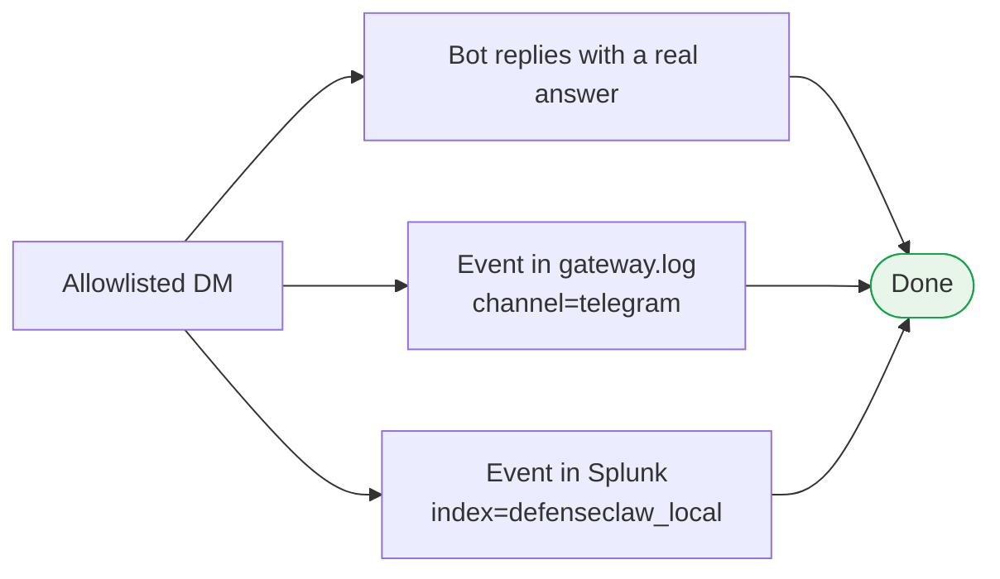

# Step 4 — Verify: chat + watch governance

Two things to confirm:

1. **The bot answers.** Send it a question from Telegram, get a real answer from your local model on your phone.
2. **It went through the guardrail.** The same message shows up in the audit log, scanned by DefenseClaw, exactly like a prompt typed into the terminal would.

## 4.1 — Send a real DM

From the account you put on the allowlist in [Step 3](phase-3.md), DM the bot a question with a clear right answer:

<div class="tg-chat" markdown>
<div class="tg-chat__header" markdown>
<div class="tg-chat__avatar">D</div>
<div class="tg-chat__title">
  <span class="tg-chat__title-name">DefenseClaw bot</span>
  <span class="tg-chat__title-sub">@DefenseClaw_bot · online</span>
</div>
</div>
<div class="tg-chat__body" markdown>
<div class="tg-msg user">What is the capital of France? One word.</div>
<div class="tg-msg bot">Paris.</div>
</div>
</div>

## 4.2 — Watch the guardrail catch it

Same places you looked in Part 1 — the Telegram message shows up next to everything else the agent sees.

### Live gateway log

The gateway is OpenClaw's running daemon — every message it processes, every scan, every reply ends up in this log file. Tail it while you DM the bot:

```bash
sudo nsenter -t $(pgrep -f openshell-sandbox | head -1) -m -n -- \
  sudo -u sandbox tail -F /tmp/openclaw-996/openclaw-*.log \
  | grep --line-buffered -iE 'telegram|verdict|sev='
```

??? note "Expected output (one line per scan)"
    ```
    "subsystem":"agent/embedded" embedded run start ... messageChannel=telegram
    "subsystem":"diagnostic" lane=session:agent:main:telegram:direct:<your-id>
    "message":"defenseclaw.plugin.sidecar_request" status_code=200
    ```

### Splunk dashboard

If you set up the bundled Splunk back in [Part 1 Step 7](../part1/07-splunk.md), the same search picks up Telegram events — just filter on the channel:

```spl
index=defenseclaw_local source="defenseclaw" earliest=-15m
| where channel="telegram"
| table _time channel sev cats action reason
| sort -_time
```

| _time | channel | sev | cats | action |
|---|---|---|---|---|
| 22:14:03 | telegram | INFO | [] | allow |
| 22:14:08 | telegram | INFO | [] | allow |

### One-shot health check

`defenseclaw doctor` walks every part of the stack and tells you which is healthy. After Step 3, all five should pass:

```bash
defenseclaw doctor 2>&1 | grep -iE 'gateway|guardrail|llm'
```

??? note "Expected output"
    ```
    [PASS] Sidecar API           — 10.200.0.1:18970
    [PASS] OpenClaw gateway      — 10.200.0.2:18789
    [PASS] Guardrail proxy       — healthy on port 4000 (mode=action)
    [PASS] LLM reachable         — ok (openai/local-llm)
    ```

## 4.3 — Definition of done for Step 4



All four boxes need to be green before moving on. If you don't get a reply on Telegram, or the log doesn't mention `messageChannel=telegram`, or Splunk shows nothing — head back to [Step 2 — Send a real DM](phase-2.md#27-send-a-real-dm). Usually one of the connections between the bot, the gateway, and the audit pipeline isn't wired right.

!!! tip "Same agent, new doorway"
    We haven't touched the model or DefenseClaw config since Part 1 — Telegram is just an extra way *in* to the same agent. That's why [Step 5](phase-5.md) (catching injection attempts) works without writing any new rules: a Telegram message is just a prompt as far as the guardrail is concerned.

[Continue to Step 5. Catch an injection →](phase-5.md){ .md-button .md-button--primary }
