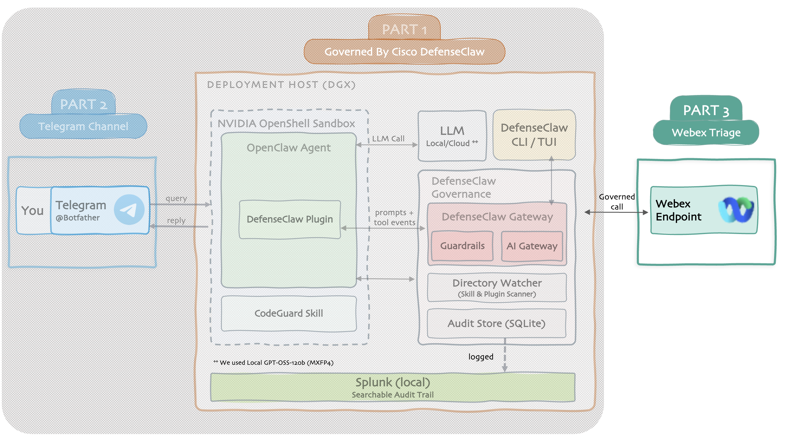

# Part 3 — Webex Triage Assistant

Turn the governed agent into a Webex triage assistant over the official Webex REST API, it reads your spaces and DMs, tells you what needs your response, clusters topics, ranks urgency, and summarizes meetings. Every step observable; every call audited.

## What you'll build

- A **Webex assistant** that tells you what actually needs your attention
- **Meeting summaries** with your action items pulled out
- **Draft replies you review** before anything is sent

## Before you start

- Make sure you've completed [Part 1](../part1/index.md) & [Part 2](../part2/index.md)
- A [Webex developer account](https://developer.webex.com){ target="_blank" rel="noopener" }

## How it works

Three layers, working together:

- **Access**, talks to Webex via its official REST API
- **Reasoning**, the local LLM does the thinking (needs-me, clustering, ranking, summaries, drafts)
- **Governance**. DefenseClaw watches and audits every Webex call

## Project Steps

### Setup + stages

<ul class="step-list">
  <li><a href="phase-0/">0 Prereqs</a></li>
  <li><a href="phase-1/">1 Webex OAuth</a></li>
  <li><a href="phase-2/">2 Wire Webex as tools</a></li>
  <li><a href="phase-3/">3 Stage 1. Read</a></li>
  <li><a href="phase-4/">4 Stage 2. Needs me</a></li>
  <li><a href="phase-5/">5 Stage 3. Cluster</a></li>
</ul>

### Stages + wrap-up

<ul class="step-list">
  <li><a href="phase-6/">6 Stage 4. Rank</a></li>
  <li><a href="phase-7/">7 Stage 5. Meetings</a></li>
  <li><a href="phase-8/">8 Stage 6. Drafts</a></li>
  <li><a href="phase-9/">9 Assemble the digest</a></li>
  <li><a href="phase-10/">10 Governance &amp; audit</a></li>
  <li><a href="webhooks/">— Webhooks (optional)</a></li>
</ul>

[Start Step 0. Prerequisites →](phase-0.md){ .md-button .md-button--primary }
