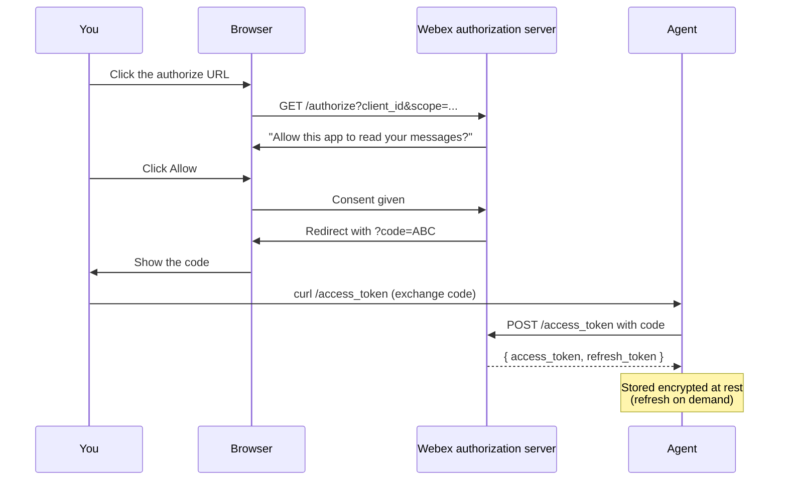

# Step 1 — The Webex integration & OAuth (exact)

Turn your integration into a stored refresh token the agent can use. These values are verified against Cisco's docs.

## How the OAuth handshake works

You're not handing Webex your password — you're letting Webex hand the agent a short-lived **access token** (good for 14 days) and a long-lived **refresh token** (good for 90 days, reset on every use). The exchange happens once in your browser, then the agent runs autonomously from there.



??? info "Why two tokens?"
    The **access token** is the short-lived key the agent presents on every API call. If it leaks, it expires in 14 days regardless. The **refresh token** is what lets the agent quietly get new access tokens without sending you back to the consent screen. Refresh tokens reset to 90 days each time they're used, so as long as the agent stays active, it never needs to re-prompt you.

## 1. Confirm the integration's scopes

The assistant needs exactly these:

| Scope | Enables |
|---|---|
| `spark:rooms_read` | List your spaces (`GET /v1/rooms`) |
| `spark:messages_read` | Read messages in your rooms + 1:1s |
| `spark:messages_write` | Send / draft replies (`POST /v1/messages`) |
| `spark:people_read` | Resolve who's who (`GET /v1/people`) |
| `meeting:schedules_read` | List meetings (`GET /v1/meetings`) |
| `meeting:schedules_write` | Book meetings (`POST /v1/meetings`) |
| `meeting:transcripts_read` | List + download transcripts |
| `meeting:summaries_read` | AI summaries (needs AI Assistant) |

## 2. Run the OAuth authorization-code flow once

Browser consent as yourself:

```bash
# 1) Send yourself to the authorize URL (one line):
https://webexapis.com/v1/authorize?client_id=<ID>&response_type=code \
  &redirect_uri=<REDIRECT>&scope=<space-separated scopes above>&state=<random>

# 2) Webex redirects back with ?code=... — exchange it for tokens:
curl -s https://webexapis.com/v1/access_token \
  -d grant_type=authorization_code -d client_id=<ID> -d client_secret=<SECRET> \
  -d code=<CODE> -d redirect_uri=<REDIRECT>
```

## 3. Store the refresh token securely (encrypted at rest)

Access tokens last 14 days; refresh them with:

```bash
curl -s https://webexapis.com/v1/access_token \
  -d grant_type=refresh_token -d client_id=<ID> -d client_secret=<SECRET> \
  -d refresh_token=<REFRESH>
# refresh token is valid 90 days and RESETS to 90 on each use → effectively perpetual
```

## 4. Verify the token works

The smallest possible call:

```bash
curl -s https://webexapis.com/v1/people/me \
  -H "Authorization: Bearer <ACCESS_TOKEN>"
```

??? note "Expected output"
    Your own profile JSON.

[Continue to Step 2. Wire Webex as governed tools →](phase-2.md){ .md-button .md-button--primary }
